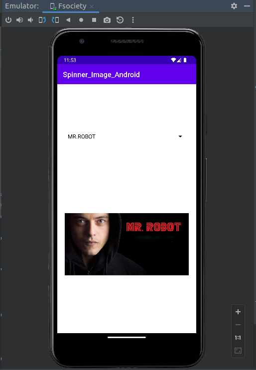
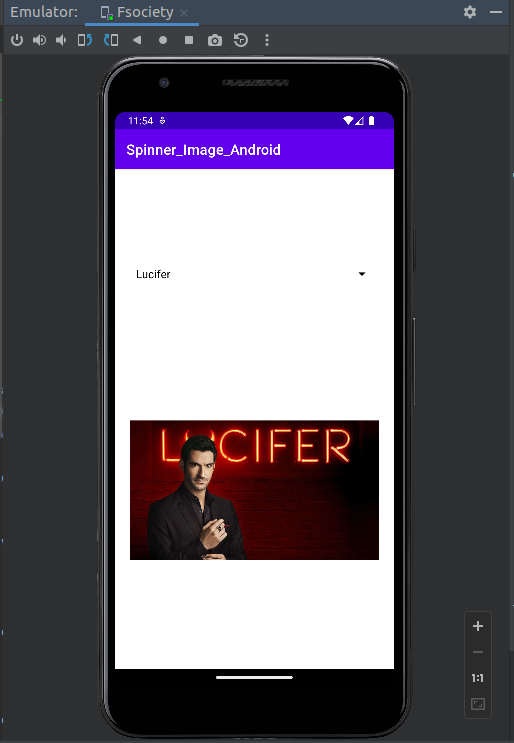
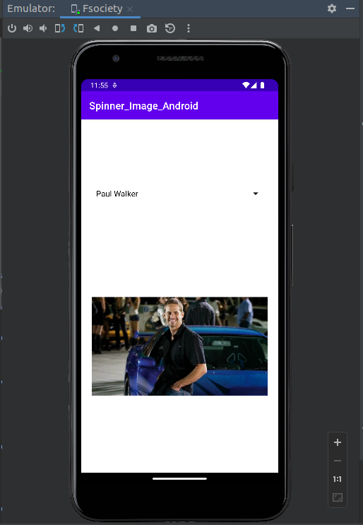
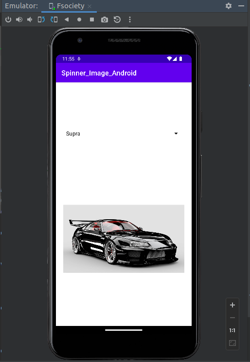

# Create spinner with strngs taken fron Resource folder (res >> value folder) and on changing the spinner value, Image will change.
>Creating a spinner with strings is a great way to add variety to your project. You can use the strings to represent different images or options. When you change the spinner value, the image will change. This can be a simple way to add more options to your project.

## MainActivity.java

    package in.codingtimes.spinner_image_android;

    import androidx.appcompat.app.AppCompatActivity;

    import android.annotation.SuppressLint;
    import android.os.Bundle;
    import android.view.View;
    import android.widget.AdapterView;
    import android.widget.ArrayAdapter;
    import android.widget.ImageView;
    import android.widget.Spinner;

    public class MainActivity extends AppCompatActivity {

        Spinner spinner;
        ImageView imageView;

        @Override
        protected void onCreate(Bundle savedInstanceState) {
            super.onCreate(savedInstanceState);
            setContentView(R.layout.activity_main);
            spinner = findViewById(R.id.spinner);
            imageView = findViewById(R.id.imageView);

            String[] arraySpinner = getResources().getStringArray(R.array.images);
            ArrayAdapter<String> arrayAdapter = new ArrayAdapter<>(this, android.R.layout.simple_spinner_dropdown_item,arraySpinner);
            arrayAdapter.setDropDownViewResource(android.R.layout.simple_spinner_dropdown_item);
            spinner.setAdapter(arrayAdapter);
            spinner.setOnItemSelectedListener(new AdapterView.OnItemSelectedListener() {
                @SuppressLint("UseCompatLoadingForDrawables")
                @Override
                public void onItemSelected(AdapterView<?> adapterView, View view, int i, long l) {
                    switch (i)
                    {
                        case 0:{
                            imageView.setImageDrawable(getResources().getDrawable(R.drawable.mrrobot));
                            break;
                        }
                        case 1:{
                            imageView.setImageDrawable(getResources().getDrawable(R.drawable.lucifer));
                            break;
                        }
                        case 2:{
                            imageView.setImageDrawable(getResources().getDrawable(R.drawable.paulwalker));
                            break;
                        }
                        case 3:{
                            imageView.setImageDrawable(getResources().getDrawable(R.drawable.supra));
                            break;
                        }
                    }
                }

                @Override
                public void onNothingSelected(AdapterView<?> adapterView) {

                }
            });
        }
    }

## AndridManifest.xml

<?xml version="1.0" encoding="utf-8"?>
<manifest xmlns:android="http://schemas.android.com/apk/res/android"
    package="in.codingtimes.spinner_image_android">

    <application
        android:allowBackup="true"
        android:icon="@mipmap/ic_launcher"
        android:label="@string/app_name"
        android:roundIcon="@mipmap/ic_launcher_round"
        android:supportsRtl="true"
        android:theme="@style/Theme.Spinner_Image_Android">
        <activity
            android:name=".MainActivity"
            android:exported="true">
            <intent-filter>
                <action android:name="android.intent.action.MAIN" />

                <category android:name="android.intent.category.LAUNCHER" />
            </intent-filter>
        </activity>
    </application>

</manifest>

## ActivityMain.xml

    <?xml version="1.0" encoding="utf-8"?>
    <androidx.constraintlayout.widget.ConstraintLayout xmlns:android="http://schemas.android.com/apk/res/android"
        xmlns:app="http://schemas.android.com/apk/res-auto"
        xmlns:tools="http://schemas.android.com/tools"
        android:layout_width="match_parent"
        android:layout_height="match_parent"
        tools:context=".MainActivity">

        <Spinner
            android:id="@+id/spinner"
            android:layout_width="350dp"
            android:layout_height="48dp"
            android:backgroundTint="@color/black"
            android:spinnerMode="dropdown"
            app:layout_constraintBottom_toTopOf="@+id/imageView"
            app:layout_constraintEnd_toEndOf="parent"
            app:layout_constraintStart_toStartOf="parent"
            app:layout_constraintTop_toTopOf="parent"
            app:layout_constraintVertical_bias="0.732"
            tools:ignore="SpeakableTextPresentCheck,SpeakableTextPresentCheck" />

        <ImageView
            android:id="@+id/imageView"
            android:layout_width="350dp"
            android:layout_height="470dp"
            android:layout_marginBottom="16dp"
            app:layout_constraintBottom_toBottomOf="parent"
            app:layout_constraintEnd_toEndOf="parent"
            app:layout_constraintStart_toStartOf="parent"
            tools:srcCompat="@tools:sample/avatars"
            android:contentDescription="@string/todo" />

    </androidx.constraintlayout.widget.ConstraintLayout>

**Repo Link :** [SpinnerImage_Android](https://github.com/amanmullaofficial/SpinnerImage_Android)

OR

Import project as vcs from here :
>
https://github.com/amanmullaofficial/SpinnerImage_Android.git

Don't know how to import from VCS : [Click Here !](https://github.com/amanmullaofficial/Android_VCS)

## Project Snapshots

